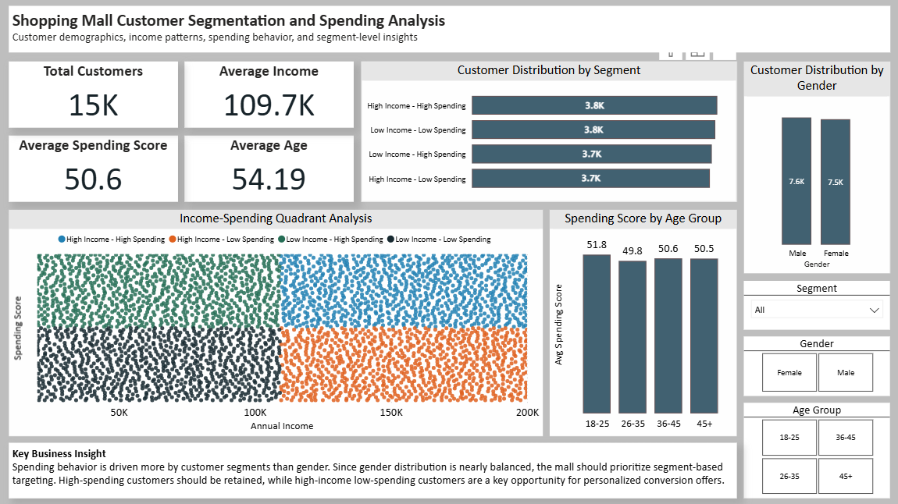
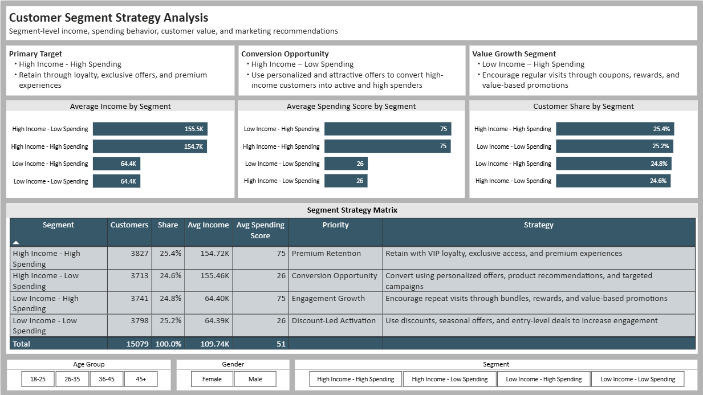

# Shopping Mall Customer Segmentation & Spending Analysis

## Project Overview

This project analyzes shopping mall customer data to understand customer demographics, income patterns, and spending behavior. The objective was to identify meaningful customer segments and provide business recommendations for customer targeting, retention, and marketing optimization.

The project was built using **Excel** and **Power BI**.

## Business Objective

The goal of this analysis was to move beyond basic demographic reporting and identify practical business opportunities through customer segmentation.

Key questions answered:

- What is the average customer age and income?
- Which gender spends more on average?
- Which age group has the highest spending score?
- Is there a relationship between annual income and spending score?
- Which customer segments should the business target?
- What strategies can improve customer retention and conversion?

## Tools Used

- Excel
- Power BI
- Power Query
- DAX

## Dashboard Pages

### Executive Overview Dashboard

This page summarizes customer profile, spending behavior, income-spending relationship, age-wise analysis, gender distribution, and segment-wise distribution.

### Segment Strategy Dashboard

This page focuses on segment-level performance, customer share, segment priorities, and recommended marketing strategies.

## Key Metrics

- Total Customers: 15,079
- Average Age: 54.19 years
- Average Annual Income: 109.74K
- Average Spending Score: 50.59
- Income-Spending Correlation: 0.00

## Customer Segments

Customers were grouped into four income-spending segments:

| Segment | Business Priority |
|---|---|
| High Income – High Spending | Premium Retention |
| High Income – Low Spending | Conversion Opportunity |
| Low Income – High Spending | Engagement Growth |
| Low Income – Low Spending | Discount-Led Activation |

## Key Insights

- Gender-based spending differences were minimal, so gender should be used as a supporting filter rather than the main targeting factor.
- Annual income and spending score showed no meaningful linear relationship.
- Segment-based targeting provides stronger business value than income-only or gender-based targeting.
- High Income – High Spending customers should be prioritized for premium retention strategies.
- High Income – Low Spending customers represent a strong conversion opportunity.

## Business Recommendations

- Retain premium customers through VIP loyalty programs, exclusive events, and personalized offers.
- Convert high-income low-spending customers using targeted premium campaigns and personalized recommendations.
- Encourage low-income high-spending customers through value-based rewards, bundles, and repeat-visit promotions.
- Activate low-income low-spending customers through coupons, seasonal discounts, and budget-friendly offers.

## Report

The full business insights report is available here:

[View Business Insights Report](reports/Shopping%20Mall%20Customer%20Segmentation%20Business%20Insights%20Report.pdf)

## Project Outcome

This project demonstrates customer segmentation, dashboard design, Power BI reporting, DAX-based analysis, and business recommendation development for marketing and retention strategy.
